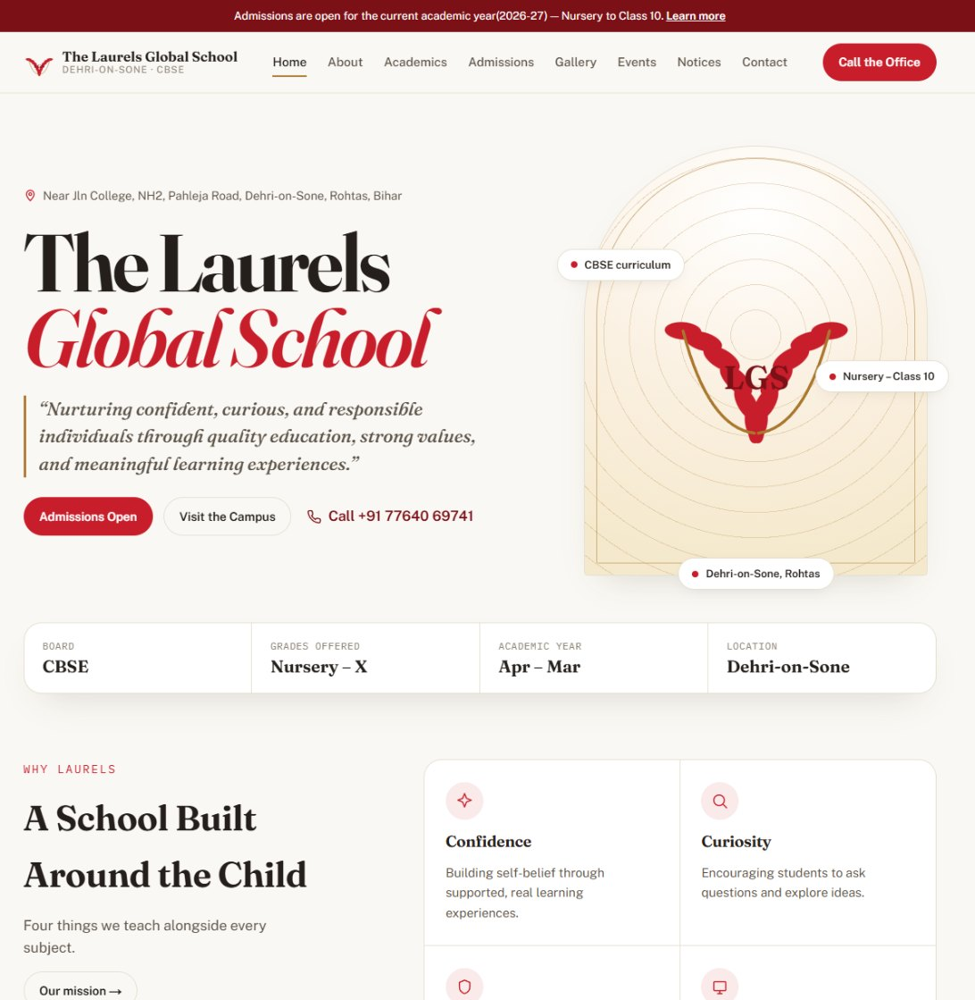
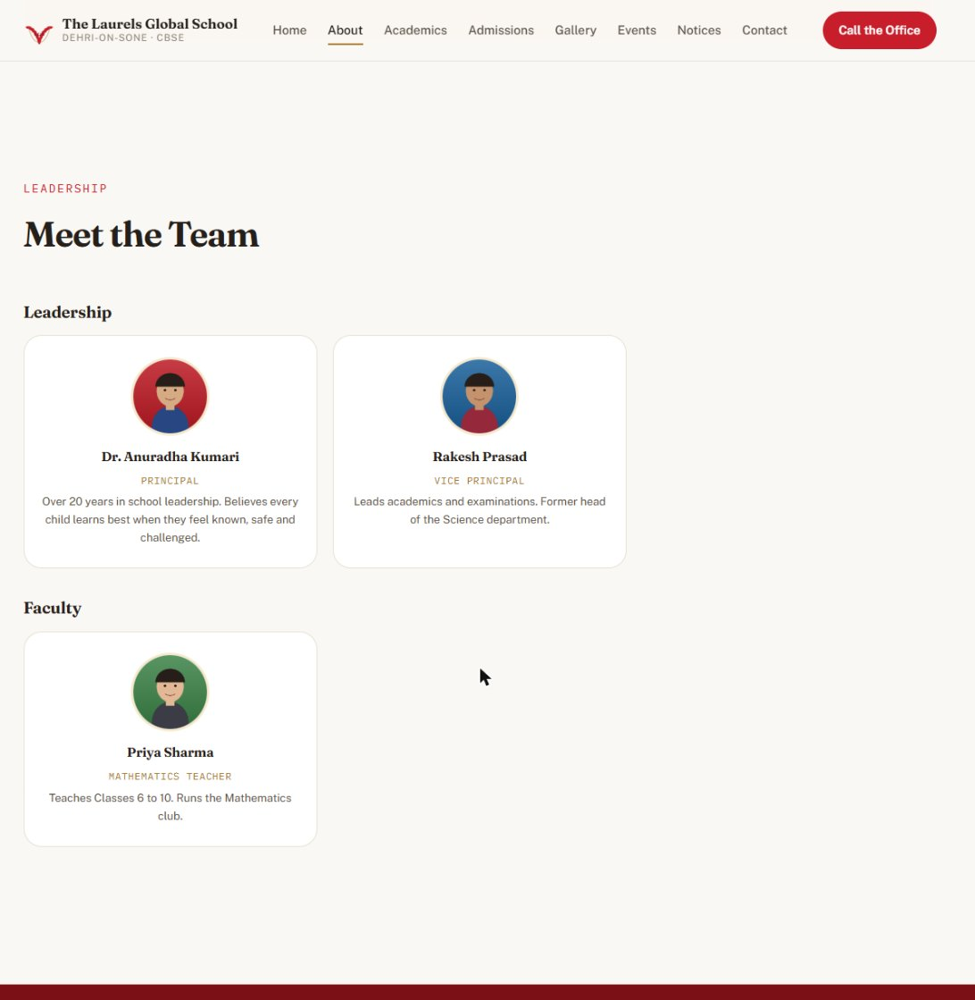
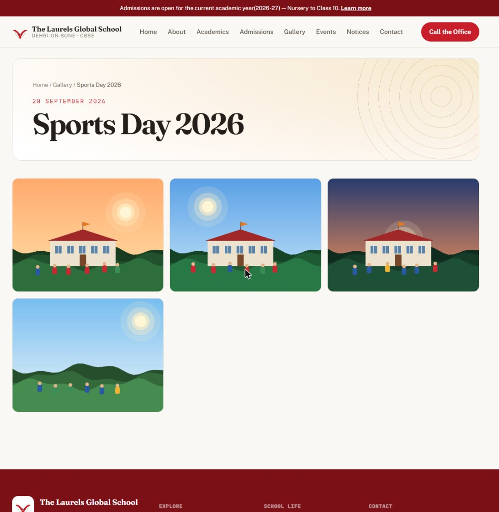
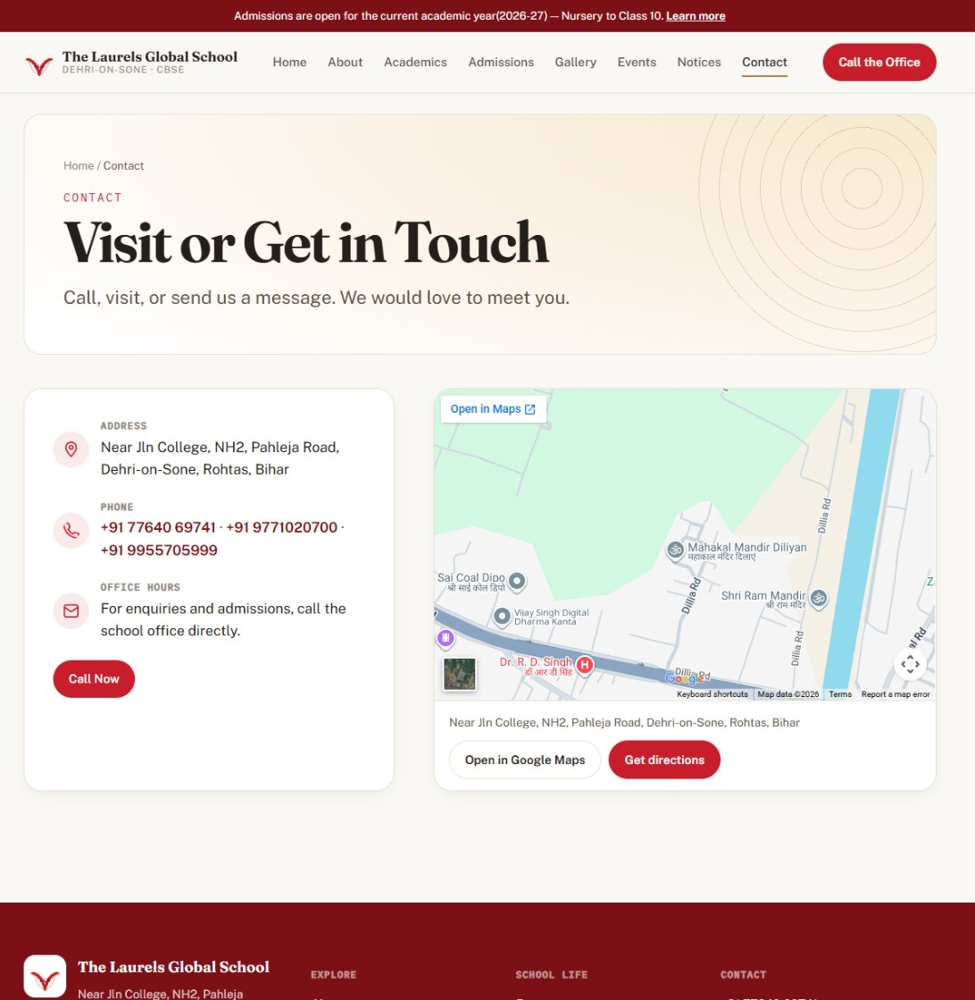
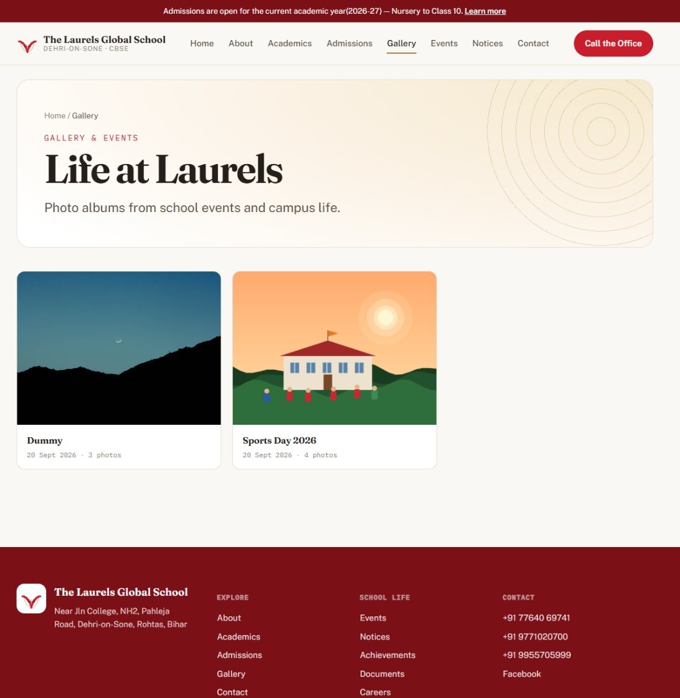
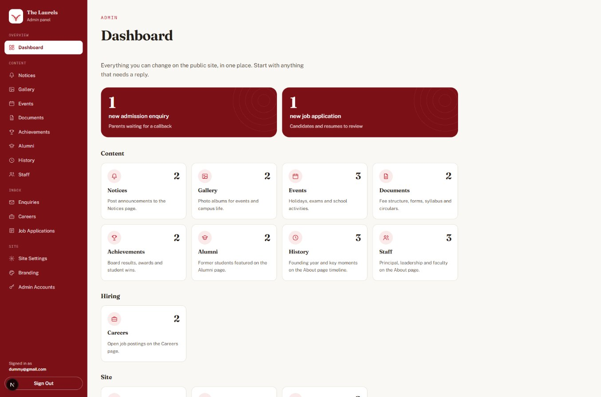
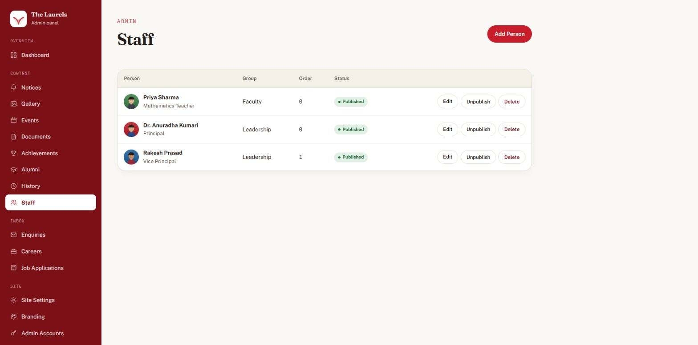
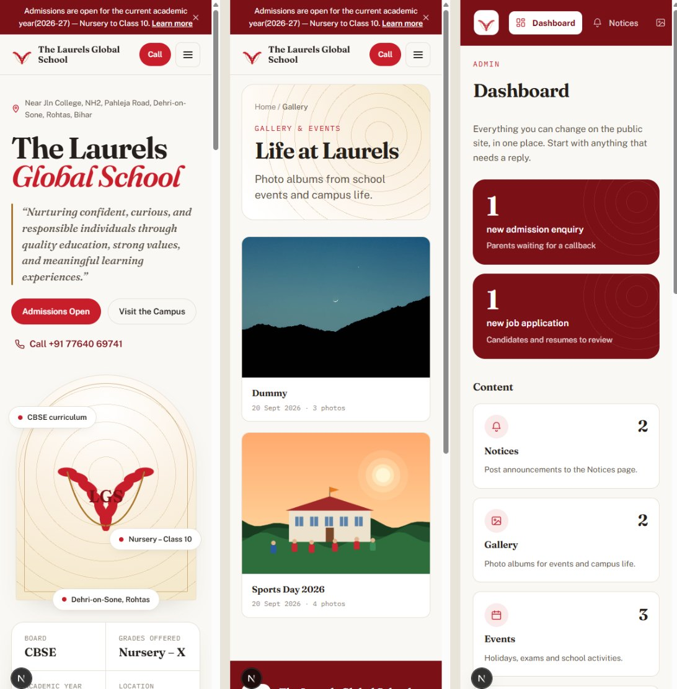
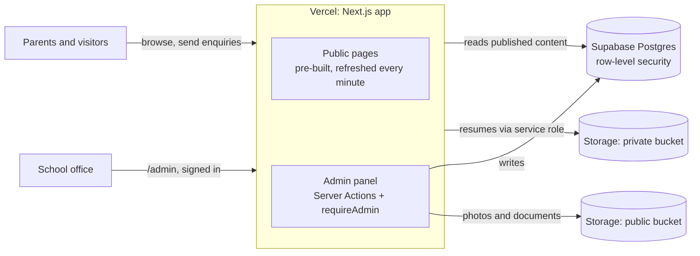

<div align="center">

# The Laurels Global School

**A modern website and easy admin panel for a CBSE school in Dehri-on-Sone, Bihar.**
Parents find everything they need. The school office updates it all without touching code.


<br />



<sub>Screenshots in this README use sample data.</sub>

</div>

---

## Contents

[Highlights](#highlights) · [Screenshots](#screenshots) · [Tech stack](#tech-stack) · [Quick start](#quick-start) · [Database setup](#database-setup) · [WhatsApp alerts](#whatsapp-alerts) · [Admin guide](#admin-guide) · [How it works](#how-it-works) · [Project structure](#project-structure) · [Scripts](#scripts) · [Security](#security) · [Deployment](#deployment) · [Status and roadmap](#status-and-roadmap)

---

## Highlights

| For parents and visitors | For the school office |
| --- | --- |
| **Admissions enquiry form** that reaches the office in seconds | **One admin panel** for every page: no code, no developer needed |
| **Live Google map** with directions on the Contact page | **Photo albums**: type a title, pick many photos, done (the date fills itself) |
| Notices, events calendar, downloadable fee structure and forms | **Inbox** for admission enquiries and job applications, with private resume links |
| Careers page with **online application and resume upload** | **Publish or unpublish** anything with one click; drafts stay hidden |
| Staff, achievements, alumni and school history timeline | Edit the banner, phone numbers, map, social links, logo and homepage text |
| **Works on phones**: tap-to-call, fast, easy to read | Sign in securely; add or disable other admins |
| | **WhatsApp alert** the moment an enquiry or job application arrives |

## Screenshots

<table>
  <tr>
    <td width="50%"><br /><sub><b>About:</b> leadership and faculty with photos</sub></td>
    <td width="50%"><br /><sub><b>Gallery:</b> albums with a title and date</sub></td>
  </tr>
  <tr>
    <td width="50%"><br /><sub><b>Contact:</b> live, interactive Google map</sub></td>
    <td width="50%"><br /><sub><b>Albums</b> grid</sub></td>
  </tr>
  <tr>
    <td width="50%"><br /><sub><b>Admin dashboard:</b> what needs a reply, and every section</sub></td>
    <td width="50%"><br /><sub><b>Admin lists:</b> edit, publish or unpublish, delete</sub></td>
  </tr>
</table>

<div align="center">
  <br />
  <sub><b>Built for phones:</b> homepage, gallery and admin panel at 390 px wide</sub>
</div>

## Tech stack

| Layer | Choice |
| --- | --- |
| Framework | [Next.js](https://nextjs.org) 16 (App Router, Server Components and Server Actions), React 19, TypeScript |
| Database, login and files | [Supabase](https://supabase.com): Postgres with row-level security, Auth, Storage (`public` and `private` buckets) |
| Hosting | [Vercel](https://vercel.com) (pages are pre-built and refresh within a minute of any change) |
| Styling | Hand-written CSS design system in `app/globals.css` (Fraunces, Public Sans and IBM Plex Mono) |

## Quick start

You need **Node.js 20+** and a free [Supabase](https://supabase.com) project.

```bash
git clone https://github.com/skillbit/laurels-global-school.git
cd laurels-global-school
npm install
cp .env.example .env.local   # or create it by hand, see below
npm run dev                  # http://localhost:3000
```

### Environment variables

Create `.env.local` (never commit it):

| Variable | Where to find it | Used for |
| --- | --- | --- |
| `NEXT_PUBLIC_SUPABASE_URL` | Supabase → Project Settings → API | Everywhere |
| `NEXT_PUBLIC_SUPABASE_ANON_KEY` | Supabase → Project Settings → API | Public reads, sign-in |
| `SUPABASE_SERVICE_ROLE_KEY` | Supabase → Project Settings → API | **Server only**: creating admin accounts and saving résumés. Never expose it. |
| `NEXT_PUBLIC_SITE_URL` | Your site address | Links in alerts, sitemap, canonical and share links. Set to the custom domain once live. |
| `WHATSAPP_*` (optional) | See [WhatsApp alerts](#whatsapp-alerts) | Office alert on new enquiries and applications |

> Tip: use a separate Supabase project for development so testing never touches live data. See [SECURITY.md](SECURITY.md).

## Database setup

Open Supabase → **SQL editor** and run these once, in order (all are safe to re-run):

| # | File | What it adds |
| --- | --- | --- |
| 1 | [`supabase/migrations/0001_init.sql`](supabase/migrations/0001_init.sql) | Tables, row-level security, storage buckets |
| 2 | [`supabase/migrations/0002_gallery_albums.sql`](supabase/migrations/0002_gallery_albums.sql) | Gallery albums (moves older loose photos into a "Campus Photos" album) |
| 3 | [`supabase/migrations/0003_milestones.sql`](supabase/migrations/0003_milestones.sql) | School history timeline |

**First admin:** Supabase → Authentication → Users → *Add user*, then add a row to the `admin_users` table with the same `id` and `is_active = true`. After that, sign in at `/admin/login` and add more admins from **Admin Accounts**.

## WhatsApp alerts

When a parent sends an admissions enquiry (or a candidate applies for a job), the office gets a short WhatsApp message, for example:

> New admission enquiry: Riya's parent (9000000001) for Class 1, child age 6. Note: … Reply from https://…/admin/enquiries

It is **optional**, sent after the form is saved, and it can never make the form fail. If several submissions arrive within minutes (a spam flood), alerts pause automatically; the entries are still saved.

Turn it on by setting environment variables (in `.env.local` for testing, and in Vercel → Settings → Environment Variables → **Production** for the live site), then redeploy. Pick **one** provider:

**Option A: Meta WhatsApp Cloud API (official, recommended for the school)**

1. Create a Meta developer app and add the **WhatsApp** product (business.facebook.com and developers.facebook.com). Add a business phone number and note its **Phone number ID**.
2. Create a permanent **system-user access token** with the `whatsapp_business_messaging` permission.
3. In WhatsApp Manager create a message template (category *Utility*, language English) named `school_alert` with this body, using **one** variable: `School website alert: {{1}}`. Wait for approval.
4. Set:
   ```
   WHATSAPP_PROVIDER=cloud
   WHATSAPP_TOKEN=<system-user token>
   WHATSAPP_PHONE_NUMBER_ID=<phone number id>
   WHATSAPP_TEMPLATE_NAME=school_alert
   WHATSAPP_TO=919771020700          # who receives it; several numbers allowed, comma separated
   ```

**Option B: CallMeBot (free, quick, uses a personal number)**

1. From the phone that should get the alerts, send `I allow callmebot to send me messages` to **+34 644 51 95 23** on WhatsApp. You will receive an API key.
2. Set:
   ```
   WHATSAPP_PROVIDER=callmebot
   CALLMEBOT_API_KEY=<the key>
   WHATSAPP_TO=919771020700
   ```
   (For several receivers, list numbers and keys in the same order, comma separated.) CallMeBot is an unofficial free service; use Option A for anything important.

Alerts contain the parent's name, phone number and a short note, so they pass through the WhatsApp provider. Send them only to staff who handle admissions (see the privacy notes in [SECURITY.md](SECURITY.md)).

## Admin guide

Sign in at **`/admin`**. The dashboard shows anything waiting for a reply, then every section.

| Section | What it controls on the public site |
| --- | --- |
| **Notices** | The Notices page |
| **Gallery** | Photo albums: title, date (defaults to today), many photos at once |
| **Events** | Events page, and the "Coming up" strip on the homepage |
| **Documents** | Fee structure, admission forms, syllabus, circulars (PDF, Word, Excel, images) |
| **Achievements** | Results and awards, with optional photos |
| **Alumni** | The Alumni page |
| **History** | The timeline on the About page (hidden until you add the first milestone) |
| **Staff** | Leadership and faculty on the About page, with photos |
| **Enquiries** | Admission enquiries: mark as contacted, delete |
| **Careers** and **Job Applications** | Open positions, and applications with private resume links |
| **Site Settings** | Announcement banner, address, phone numbers (several allowed, separate with commas), email, map link, social links, homepage quote, mission statement, quick facts |
| **Branding** | School logo and browser-tab icon |
| **Admin Accounts** | Who can sign in |

Changes appear on the live site within about a minute.

## How it works



- **Public pages** read only published rows through a cookie-less client, so they can be served as static pages and stay fast.
- **Admin actions** check the signed-in admin on the server (`requireAdmin()`), and the database repeats that check with row-level security, so a mistake in one layer can't expose data.
- **Uploads** (photos, documents, logos) go from the browser straight to Supabase Storage. **Resumes** are the exception: they go through a Server Action into the private bucket and are only ever opened through 1-hour signed links.

## Project structure

```
app/
  (site)/                  public pages: home, about, academics, admissions, contact,
                           gallery, notices, events, documents, achievements, careers, alumni
  admin/(protected)/       admin pages, one folder per section
  admin/login/             sign-in
  not-found.tsx, error.tsx branded 404 and error pages
components/
  site/                    Header, Footer, PageHeader, forms, cards
  admin/                   sidebar, icons, forms
lib/
  supabase/                server, browser, public (cookie-less) and service-role clients
  site-settings.ts         loads the editable settings with safe fallbacks
scripts/security-probe.mjs re-runnable database/storage security check
supabase/migrations/       SQL schema
docs/screenshots/          images used in this README
```

## Scripts

| Command | What it does |
| --- | --- |
| `npm run dev` | Start the dev server at http://localhost:3000 |
| `npm run build` | Production build |
| `npm run start` | Run the production build |
| `npm run lint` | ESLint |
| `npm run security:probe` | Check what the public key can and can't do in the database and storage |

## Security

The app was reviewed end to end: access control, database rules, uploads, headers, dependencies and secrets. Highlights: every admin action is guarded, the database refuses public reads and writes on private data (verified with only the public key), no secrets are in the repo, and `npm audit` is clean.

**Open items, fixes and checklists are in [SECURITY.md](SECURITY.md).** The most important one to finish before the site is promoted widely is protecting the public forms against spam.

## Deployment

1. Push to `main`; Vercel builds and deploys automatically.
2. Set the three environment variables above in Vercel (Production only).
3. Run the SQL migrations in Supabase.
4. Custom domain (`thelaurelsglobalschool.com`): in GoDaddy add `A @ → 216.198.79.1` and `CNAME www → cname.vercel-dns.com` (remove the default `@` and `www` records first).

## Status and roadmap

**Done:** all public pages, the full admin panel, live map, photo albums, history timeline, mobile layouts, branded 404/error pages, security review.

**Next:** link the custom domain · SEO (sitemap, share images, school schema, Search Console) · protect public forms from spam · two-factor sign-in for admins · school-supplied content (real staff, map pin, affiliation number, subjects and facilities).

The working to-do list lives in [`CLAUDE.md`](CLAUDE.md).

---

<div align="center">
  <sub>© The Laurels Global School, Dehri-on-Sone, Rohtas, Bihar. All rights reserved.</sub>
</div>
